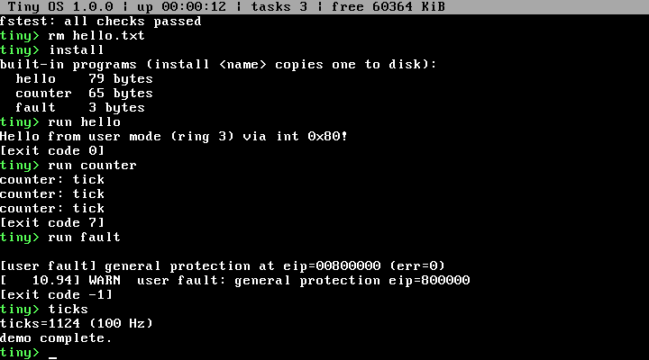

# tinykernel

A tiny 32-bit hobby OS for x86, written from scratch: BIOS bootloader → protected mode → freestanding C kernel with a keyboard-driven shell, memory allocator, preemptive multitasking, a disk filesystem and ring 3 user programs.



## What's inside

- **Boot:** BIOS boot sector, E820 memory map, multi-track INT 13h kernel load, GDT/TSS/IDT, PIC and 100 Hz PIT.
- **Drivers:** VGA text console (scrolling, colors, cursor, status bar), PS/2 keyboard (IRQ, ring buffer, shift/caps/ctrl/arrows), COM1 serial, ATA PIO disk.
- **Memory:** bitmap physical frame allocator and a coalescing `kmalloc`/`kfree` heap with a randomized self-test.
- **Tasks:** control blocks, context switch, round-robin scheduler driven by the timer, sleeping, task API.
- **Filesystem:** TinyFS (contiguous, 32 files) with `ls`, `cat`, `write`, `touch`, `rm`, `format`.
- **User mode:** program loader, ring 3, `int 0x80` syscalls, fault containment, three built-in programs.
- **Shell:** line editing, history (up/down), quoting, 29 commands including a scripted `demo`.

See [docs/MODULES.md](docs/MODULES.md) for the module map and [docs/DEVELOPER.md](docs/DEVELOPER.md) for the build/test workflow. A recorded run of the `demo` command is in [docs/demo-run.txt](docs/demo-run.txt).

## Prerequisites

- `gcc` (MinGW-w64, 32-bit capable), `nasm`, `make`, `binutils` (`ld`, `objcopy`)
- `qemu-system-i386`
- `dd` (Git Bash / MSYS2)
- Python 3 (optional, only for `tools/qemu_drive.py`)

On Windows with Git Bash, if tools are missing from `PATH`, open a new terminal or run `source ~/.bashrc`.

## Build and run

```bash
make          # builds build/os-image.bin
make run      # boots in QEMU (floppy = OS, IDE disk = build/disk.img)
```

At the `tiny>` prompt try `help`, or just `demo`.

| Command              | What it does                                                    |
| -------------------- | --------------------------------------------------------------- |
| `make` / `make all`  | Build `build/os-image.bin`                                      |
| `make run`           | Boot in QEMU with a data disk; serial log in `build/serial.log` |
| `make run-headless`  | Same without a window                                           |
| `make clean-disk`    | Delete the data disk (all files)                                |
| `make clean`         | Remove build artifacts                                          |

## Shell commands

`help clear version echo ticks uptime sleep meminfo memtest hexdump dmesg ps spawn kill ls cat write touch rm format fstest disk install run history color contest demo reboot halt`

Files need a formatted disk: run `format` once. `install` lists the built-in user programs (`hello`, `counter`, `fault`); `run hello` executes one in ring 3.

## Boot flow

1. BIOS loads the boot sector to `0x7C00`; it stores the E820 map at `0x500`, reads the kernel from the floppy (sector 2+) to `0x10000`, enables A20 and enters protected mode.
2. The kernel is copied to `0x100000` and `_kernel_start` calls `kernel_main`.
3. `kernel_main` sets up the GDT, IDT, PIC, memory, timer, scheduler and keyboard IRQ, mounts the disk, starts the status-bar task and hands control to the shell.

## Project layout

```
boot/boot.asm         boot sector
kernel/*.c, *.S       kernel modules (see docs/MODULES.md)
include/*.h           module headers
user/*.asm            built-in ring 3 programs
tools/qemu_drive.py   headless test driver
docs/                 module docs, developer guide, demo transcript
```
